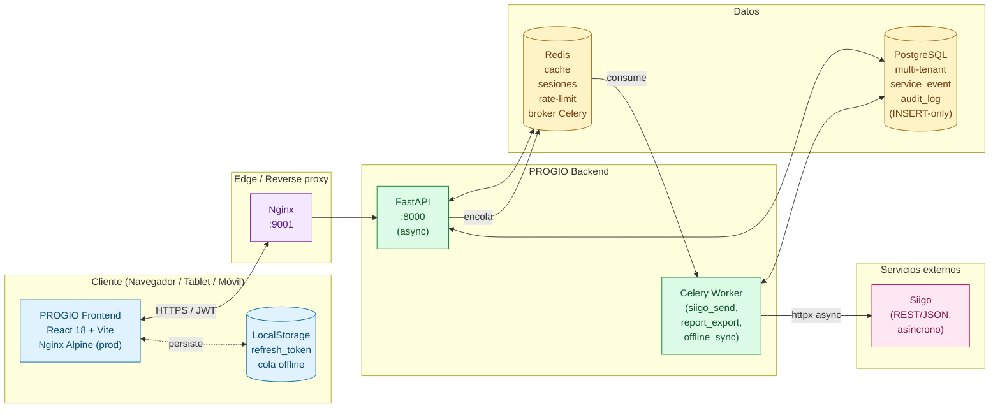
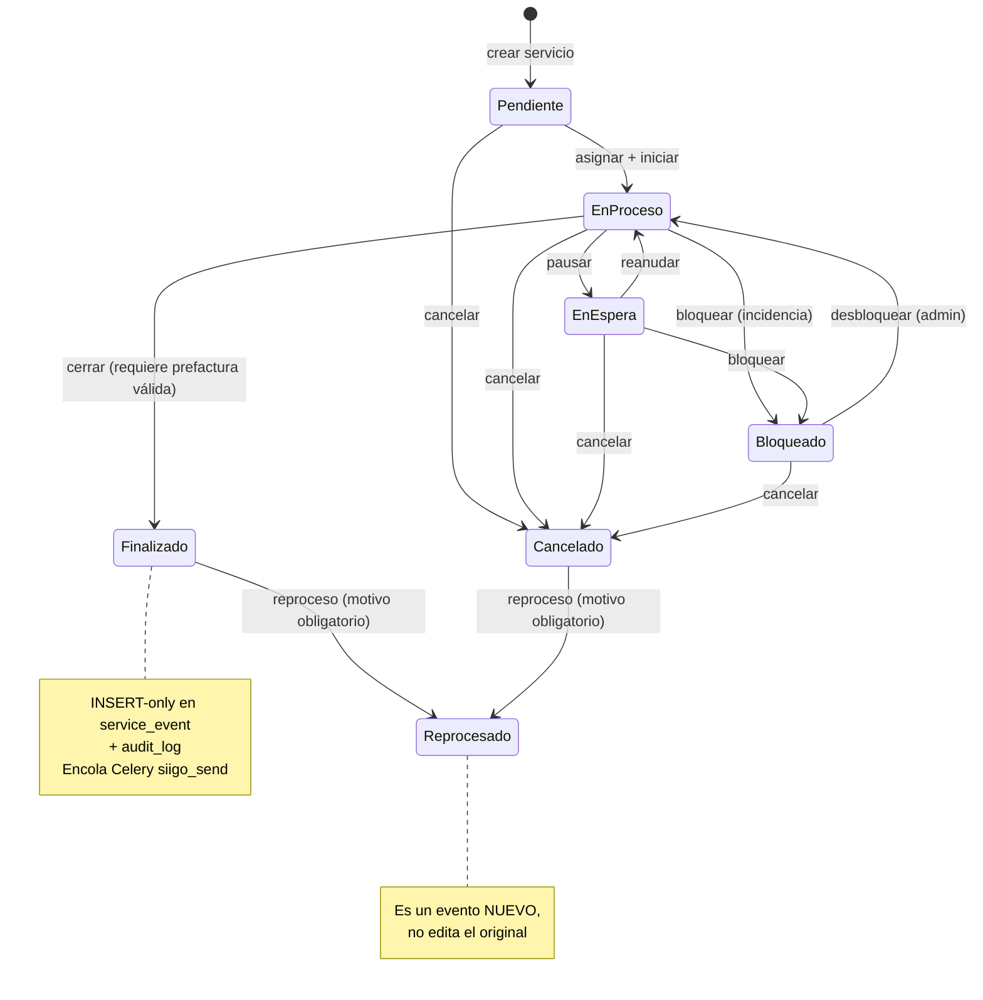
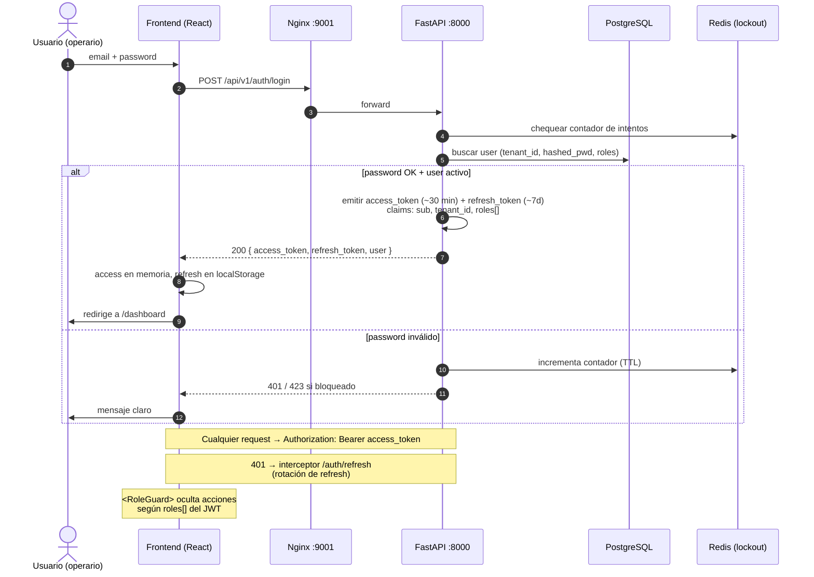
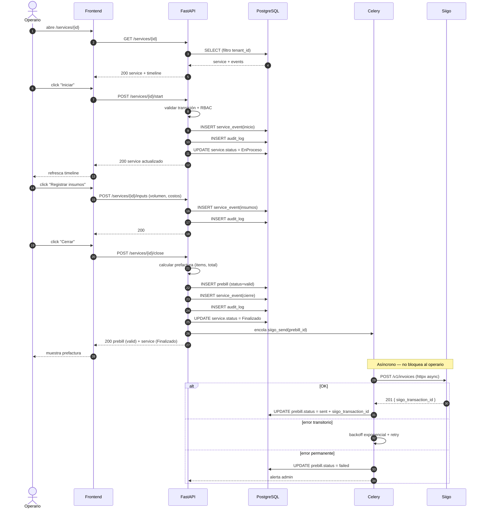
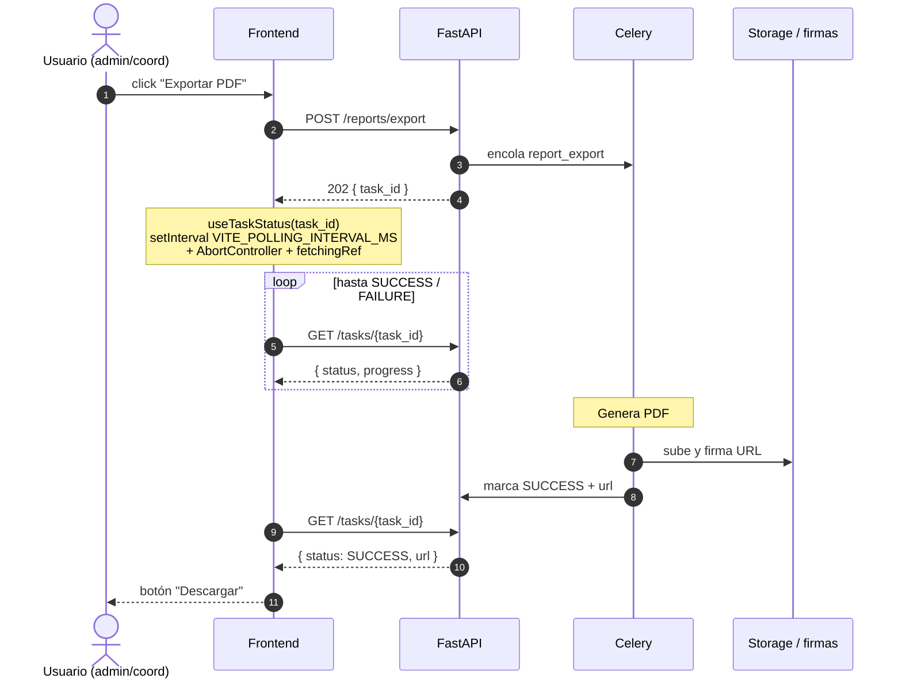
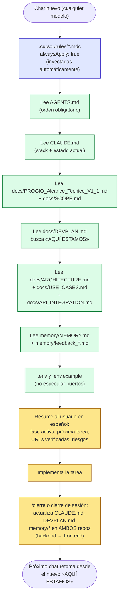

# PROGIO — Casos de Uso y Flujos de Solución (Mermaid)

> Fuente única de los diagramas Mermaid del proyecto. Se mantienen sincronizados entre `progio-backend/docs/USE_CASES.md` y `progio-frontend/docs/USE_CASES.md`.
>
> Cada diagrama puede pegarse en https://mermaid.live para exportarlo como PNG/SVG.

## Convenciones

- **Backend (FastAPI)**: contenedor `api` detrás de `nginx`.
- **Frontend (React)**: SPA en contenedor `frontend` (Nginx Alpine).
- **Roles**: `admin_general`, `admin_contrato`, `coordinador_operaciones`, `supervisor`, `operario`, `interventor`.
- **Estados de servicio**: `Pendiente`, `En Proceso`, `En Espera`, `Finalizado`, `Cancelado`, `Reprocesado`, `Bloqueado`.

---

## 1. Arquitectura general (alto nivel)



---

## 2. Diagrama de casos de uso (actores y permisos)

```mermaid
flowchart LR
    %% Actores
    AG((["admin_general"]))
    AC((["admin_contrato"]))
    CO((["coordinador_<br/>operaciones"]))
    SV((["supervisor"]))
    OP((["operario"]))
    IN((["interventor"]))

    %% Casos de uso por dominio
    subgraph IdAuth["Identidad / Auth"]
        UC_LOGIN["Iniciar sesión"]
        UC_VAL["Validar sesión"]
        UC_LOGOUT["Cerrar sesión"]
    end

    subgraph Tenancy["Tenants / Usuarios"]
        UC_TENANT["Gestionar tenants<br/>(super-admin)"]
        UC_USERS["Gestionar usuarios<br/>(por tenant)"]
        UC_ROLES["Asignar roles"]
    end

    subgraph Contrato["Contratos / Activos"]
        UC_CONTRACT["Gestionar contratos<br/>+ cupos"]
        UC_SITE["Gestionar sedes"]
        UC_ASSET["Gestionar activos"]
    end

    subgraph Servicios["Operación de servicio"]
        UC_CREATE["Crear servicio"]
        UC_ASSIGN["Asignar operario"]
        UC_START["Iniciar servicio"]
        UC_PAUSE["Pausar / Reanudar"]
        UC_INPUTS["Registrar insumos"]
        UC_SUPER["Supervisar / validar"]
        UC_CLOSE["Cerrar servicio<br/>(requiere prefactura)"]
        UC_CANCEL["Cancelar servicio"]
        UC_REPROC["Reprocesar (motivo<br/>obligatorio)"]
    end

    subgraph PreFact["Prefactura / Siigo"]
        UC_PREBILL["Generar prefactura"]
        UC_RETRY["Reintentar envío Siigo"]
    end

    subgraph Audit["Auditoría / Reportes"]
        UC_AUDIT["Consultar auditoría<br/>(read-only)"]
        UC_TIMELINE["Ver línea de tiempo<br/>de un servicio"]
        UC_REPORT["Reportes y KPIs<br/>(operativos / ambientales /<br/>económicos)"]
        UC_EXPORT["Exportar PDF/Excel"]
    end

    subgraph Offline["Offline"]
        UC_OFF_CAP["Capturar evento<br/>sin conexión"]
        UC_OFF_SYNC["Sincronizar al<br/>recuperar conexión"]
    end

    %% Relaciones (todos hacen login/logout)
    AG --> UC_LOGIN
    AC --> UC_LOGIN
    CO --> UC_LOGIN
    SV --> UC_LOGIN
    OP --> UC_LOGIN
    IN --> UC_LOGIN
    AG --> UC_LOGOUT
    AC --> UC_LOGOUT
    CO --> UC_LOGOUT
    SV --> UC_LOGOUT
    OP --> UC_LOGOUT
    IN --> UC_LOGOUT

    %% Tenants (super-admin)
    AG --> UC_TENANT
    AG --> UC_USERS
    AC --> UC_USERS
    AG --> UC_ROLES
    AC --> UC_ROLES

    %% Contratos
    AG --> UC_CONTRACT
    AC --> UC_CONTRACT
    AG --> UC_SITE
    AC --> UC_SITE
    AG --> UC_ASSET
    AC --> UC_ASSET

    %% Servicios
    AG --> UC_CREATE
    AC --> UC_CREATE
    CO --> UC_CREATE
    CO --> UC_ASSIGN
    AC --> UC_ASSIGN
    OP --> UC_START
    OP --> UC_PAUSE
    OP --> UC_INPUTS
    OP --> UC_CLOSE
    SV --> UC_SUPER
    CO --> UC_CANCEL
    AC --> UC_CANCEL
    AG --> UC_REPROC
    AC --> UC_REPROC
    CO --> UC_REPROC

    %% Prefactura
    AG --> UC_PREBILL
    AC --> UC_PREBILL
    AG --> UC_RETRY
    AC --> UC_RETRY

    %% Auditoría / reportes
    AG --> UC_AUDIT
    AC --> UC_AUDIT
    IN --> UC_AUDIT
    AG --> UC_TIMELINE
    AC --> UC_TIMELINE
    CO --> UC_TIMELINE
    SV --> UC_TIMELINE
    OP --> UC_TIMELINE
    IN --> UC_TIMELINE
    AG --> UC_REPORT
    AC --> UC_REPORT
    CO --> UC_REPORT
    IN --> UC_REPORT
    AG --> UC_EXPORT
    AC --> UC_EXPORT
    CO --> UC_EXPORT

    %% Offline (operario en campo)
    OP --> UC_OFF_CAP
    OP --> UC_OFF_SYNC

    classDef actor fill:#fde68a,stroke:#a16207,color:#713f12
    class AG,AC,CO,SV,OP,IN actor
```

---

## 3. Máquina de estados del servicio



---

## 4. Flujo de Login + Auth + RBAC



---

## 5. Ciclo de vida del servicio — feliz path (operario)



---

## 6. Sincronización Offline (módulo 3.3)

```mermaid
sequenceDiagram
    autonumber
    actor OP as Operario (sin conexión)
    participant FE as Frontend
    participant LS as LocalStorage
    participant API as FastAPI
    participant DB as PostgreSQL

    Note over OP,FE: navigator.onLine === false
    OP->>FE: click "Pausar"
    FE->>FE: client_event_id = crypto.randomUUID()
    FE->>LS: push { client_event_id, service_id, event_type, payload, captured_at }
    FE-->>OP: toast "Guardado localmente, se sincronizará"

    Note over OP,FE: ... más eventos offline ...

    Note over FE: evento window 'online' o intervalo VITE_OFFLINE_SYNC_INTERVAL_MS
    FE->>LS: leer cola
    FE->>FE: agrupar por service_id
    loop por cada service_id
        FE->>API: POST /services/{id}/events/sync<br/>{ events: [...] }
        API->>API: validar JWT + tenant + RBAC
        loop por cada evento
            API->>DB: SELECT por client_event_id (idempotencia)
            alt ya existe
                API->>API: marcar como aceptado (sin duplicar)
            else no existe
                API->>API: validar transición vs estado actual
                alt transición válida
                    API->>DB: INSERT service_event
                    API->>DB: INSERT audit_log
                    API->>DB: UPDATE service.status si aplica
                else transición inválida
                    API->>API: marcar como rejected (motivo)
                end
            end
        end
        API-->>FE: { accepted: [...], rejected: [...] }
        FE->>LS: eliminar accepted; mantener rejected con marca
        FE-->>OP: indicador "Sincronizando 3 eventos…" → desaparece
    end
```

---

## 7. Polling de tareas Celery (export reportes / retry Siigo)



---

## 8. Flujo del agente IA (3 capas de memoria — meta)



---

## Notas de mantenimiento

- Cuando cambie un flujo crítico (auth, eventos, prefactura, offline), actualizar este archivo en **ambos repos** (`progio-backend/docs/USE_CASES.md` y `progio-frontend/docs/USE_CASES.md`).
- Los diagramas se renderizan automáticamente en Cursor, GitHub y previews Markdown que soporten Mermaid.
- Para PNG estático: pegar el bloque ```mermaid``` correspondiente en https://mermaid.live → Export PNG.
